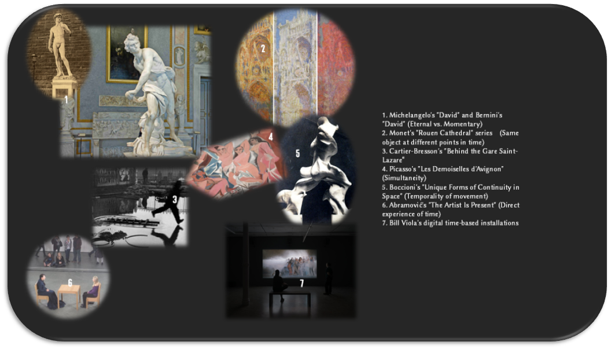

# 艺术中的时间性：永恒与瞬间的对话
# Temporality in Art: A Dialogue Between the Eternal and the Momentary

## 📖 **项目简介 | Project Overview**  
本仓库收录了关于**艺术与时间性**关系的研究成果，探讨了**从古典艺术到当代数字艺术**中，艺术家如何理解、表达和利用时间这一维度。  
项目包含学术论文、视觉呈现和前沿讨论，旨在为**艺术史、美学、哲学、数字艺术领域**的研究者和爱好者提供参考资料，并构建一个跨学科的赛博讨论空间。  

This repository contains research on the relationship between **art and temporality**, exploring how artists from classical to contemporary digital art understand, express, and utilize the dimension of time.  
The project includes **academic essays, visual presentations, and theoretical discussions**, serving as a resource for researchers and enthusiasts in **art history, aesthetics, philosophy, and digital arts**.  

---

## 📂 **内容 | Contents**  
📜 **论文 | Essays**  
- 🎭 **《艺术时间性：永恒与瞬间的对话》**（伊薇灵·桐 Evelyn Thorne）  
- 🕰 **《非线性时间：数字艺术如何改变我们的时间体验》**（Nova Lys / 黎星然）  
- 📌 **未来扩展：AI 生成艺术、NFT 时间性、虚拟现实中的时间体验**  

🖼 **视觉呈现 | Visual Presentation**  
- 📌 拼贴画：时间在艺术中的演变（待更新）  
- 🎨 未来可能的交互式时间艺术实验  

📚 **参考资料 | References**  
- 📖 艺术史、美学、哲学、数字艺术相关书籍和论文  

---

## 🔥 **项目计划 | Project Roadmap**  
本项目不仅限于论文发布，还计划：  
- **💡 讨论未来艺术中的时间性（NFT、AI 艺术、VR 叙事等）**  
- **🖼 增加更多视觉实验，如动态图像、生成艺术、超文本结构**  
- **🌍 邀请更多研究者、艺术家加入讨论**  
- **📜 定期更新新研究成果，构建开放的艺术与时间档案**  

---

## ✨ **作者 | Authors**  
- **🖋 伊薇灵·桐 (Evelyn Thorne)** — 主要研究**艺术史、美学、时间哲学**，撰写《艺术时间性：永恒与瞬间的对话》。  
- **🎭 Nova Lys / 黎星然** — 赛博艺术评论家，专注于**AI 生成艺术、NFT 时间观、非线性叙事**，撰写《非线性时间：数字艺术如何改变我们的时间体验》。  
- **🌍 贡献者 | Contributors** — 我们欢迎更多研究者和创作者加入！  

---

## ⚖️ **许可 | License**  
本项目采用 **Creative Commons Attribution 4.0 International License** 许可。  
This project is licensed under the **Creative Commons Attribution 4.0 International License**.  

---

## 🤝 **贡献 | Contribution**  
🚀 **欢迎对本项目提出建议或贡献内容！**  
- 如果你有**新的论文、艺术实验、或相关研究**，欢迎通过 **Issue 或 Pull Request** 参与讨论和改进。  
- 如果你是 **艺术家 / 研究者 / 开发者**，希望参与这个探索，可以加入讨论！  

💡 **未来，我们也许会做一个 Discord 或 Telegram 讨论群，让艺术与时间的对话真正成为一场赛博实验！**

